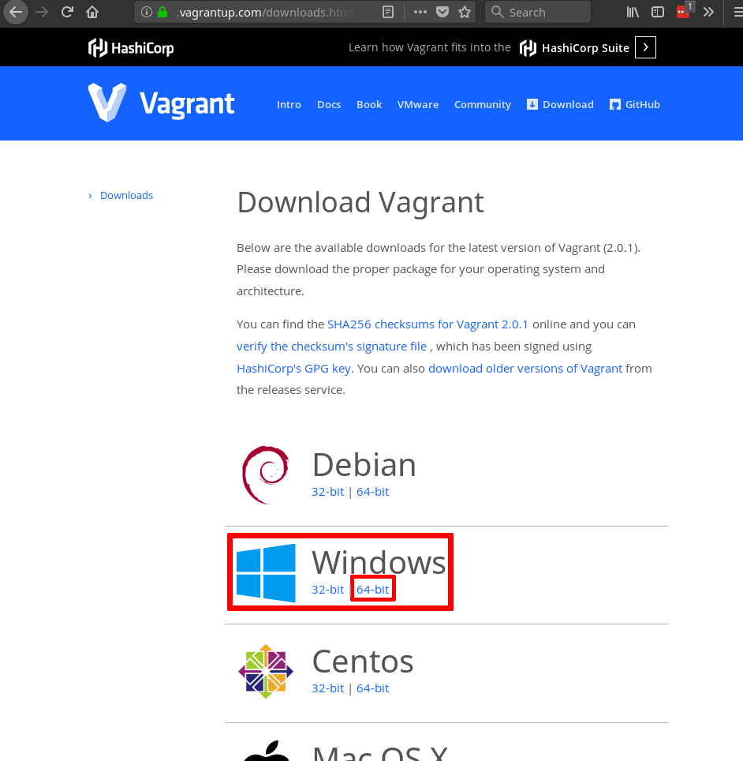
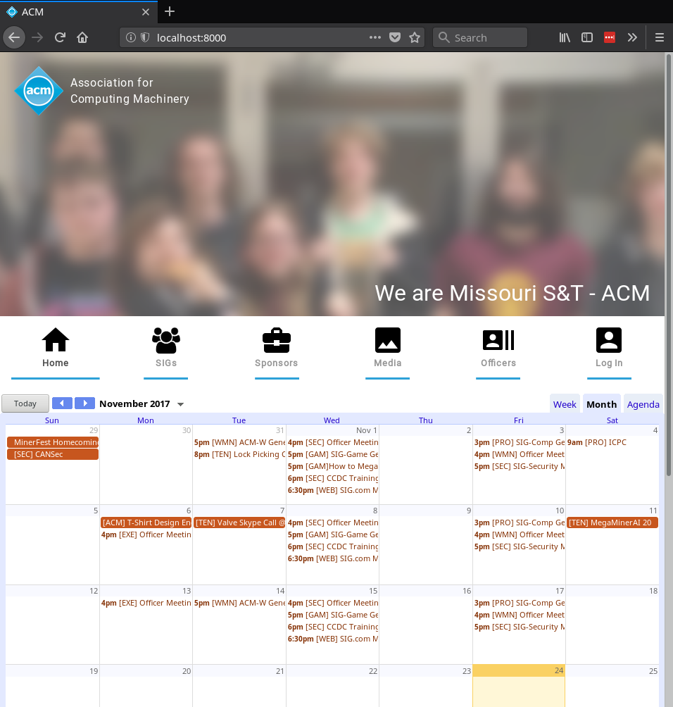

==========================
Setting up the environment
==========================

The first step towards developing is setting up your local environment.

------------
Download Git
------------
In order to download the code locally, you need to use `Git`_.  `Git`_ is a
source control management system which helps version and revise code. For more
information and usage, please view the :ref:`Git tutorial <tutorial-git>`. 

Additional Resource:
    1. https://www.atlassian.com/git/tutorials/install-git
    2. https://git-scm.com/book/en/v2/Getting-Started-Installing-Git

Windows
=======
Command-line
------------
If you're comfortable with the command line, `Git`_ has a command-line version
called ``Git Bash``. ``Git Bash`` is a BASH "emulator" that allows you to run
`Git`_ commands just like on a UNIX computer terminal (think of the commands you
would run over PuTTy in CS 1570). 

There are two main ways you can install `Git`_ for command line:

1. `Official Git`_
2. `Git for Windows`_

.. note::
    In the installation settings for `Official Git`_, you need to explicitly
    include Git Bash. Otherwise, it will not be installed.

Click on the link in the list above and follow the installation instructions for 
the Window's executable.

.. _Official Git: https://git-scm.com/downloads
.. _Git for Windows: https://git-for-windows.github.io

GUI Client
----------
Some common `Git`_ GUI clients include:

1. `GitKraken`_
2. `GitHub Desktop`_
3. `TortoiseGit`_

There are pros and cons for each option, but overall I recommend using
`GitKraken`_.

To install any of these options, click on the link to their website and download
the Window's executable.

For a fairly long tutorial on how to use `GitKraken`_ with GitHub, see
`a GitKraken Tutorial <https://www.youtube.com/watch?v=f0y_xCeM1Rk>`_.

.. _GitKraken: https://www.gitkraken.com/
.. _GitHub Desktop: https://desktop.github.com/
.. _TortoiseGit: https://tortoisegit.org/

-----------------------
Create a GitHub account
-----------------------
All of the SIG.com code is stored on `GitHub`_. In order to gain access to this
code, you will need to create a `GitHub`_ account by going onto
https://github.com. 

`GitHub`_ offers paid plans for user accounts, but to work on SIG.com code you
will only need a free account. We recommend that you use a personal email for
the account so that you can publicize your contributions as well as host your
own personal projects on `GitHub`_.

.. _overview-ssh-key:

---------------------------
Adding SSH Key (Optional)
---------------------------
Every time you want to push/pull/clone using Git, you will need to enter your
`GitHub`_ username and password. However, adding a SSH key to your `GitHub`_
account simplifies this process on your local computer. 

In order to add a SSH key, follow the `GitLab guide
<https://gitlab.com/help/ssh/README>`_ up to step 5. Then, follow the `GitHub
adding a new SSH key guide
<https://help.github.com/articles/adding-a-new-ssh-key-to-your-github-account/>`_
.

.. _GitHub: https://github.com/
.. _PuTTYgen: https://www.chiark.greenend.org.uk/~sgtatham/putty/latest.html

.. _overview-clone-repo:

--------------------
Clone the repository
--------------------
Now that you have `Git`_ installed, clone the `acm.mst.edu repository
<https://github.com/sigdotcom/acm.mst.edu>`_ from `GitHub`_. Cloning in `Git`_
is just a special term for downloading all of the files saved on the remote
location, called the remote repository. In this case, the remote repository is
located on `GitHub`_. 

Command-line
============
Open ``Git Bash``, ``cmd``, or any terminal and type::

    git clone https://github.com/sigdotcom/acm.mst.edu.git

If you :ref:`added your ssh key <overview-ssh-key>`, you can use the following
command::

    git clone git@github.com:sigdotcom/acm.mst.edu.git

.. _environment-root_dir:

Now, you should a folder named ``acm.mst.edu`` in the current directory.

.. note:: Be sure to keep track of where this folder is located, you will need
          it to edit and interact with the code later. The full path to this
          folder will be refered to as ``$ROOT_DIR`` later in this
          documentation.

.. _Git: https://git-scm.com
.. _GitHub: https://github.com/

GUI
===
Open GitKraken and follow the initial prompts to clone the repository.

------------------
Installing Vagrant
------------------
To allow for a contiguous development environment for all developers, SIG.com
utilizes `Vagrant`_. For more information about `Vagrant`_, please see the
:ref:`Vagrant Tutorial <tutorial-vagrant>`.

Windows
=======
Download the Windows 64-bit executable from the `Vagrant Downloads
<https://www.vagrantup.com/downloads.html>`_ page.

.. _Vagrant: https://www.vagrantup.com/

---------------
Running Vagrant
---------------
1. Open up ``cmd``, ``Git Bash``, or any other terminal. 
2. Navigate to ``$ROOT_DIR``, the full path to the cloned repository created
   :ref:`here <environment-root_dir>`. In your current directory, you should see
   a file named ``Vagrantfile`` (Run ``ls`` for linux or ``dir`` for Windows).
3. Type ``vagrant up`` in the terminal.
4. Open up a web browser and type http://localhost:8000. If you see something
   resembling the following image, success!

