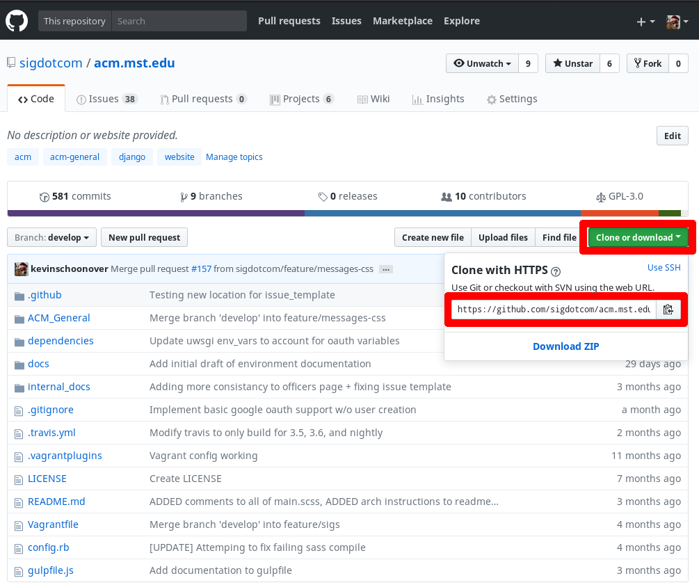
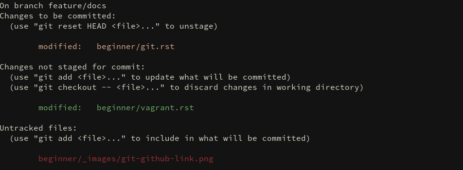
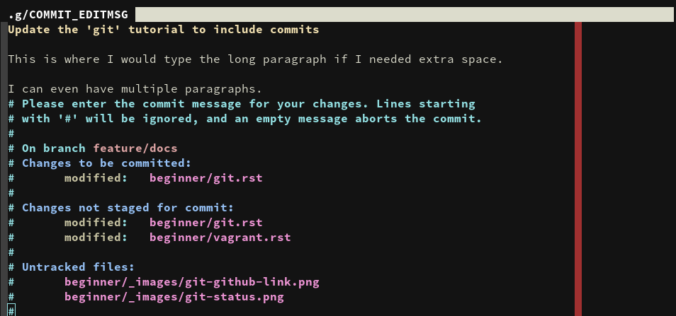

.. _tutorial-git:

===
Git
===
Git is a powerful version control system which is utilized very heavily around
the world. In almost any job, you will expected to use some form of version
control system. This tutorial will focus mainly on the basics of how to use git
with regards to GitHub, but if you're interested in learning more look at the
:ref:`references section <git-references>`.

------------------------
What is Version Control?
------------------------
When something is called 'version control' what does that mean exactly? 

The primary feature of a 'version control' system is that it keeps tracks of
'code revisions' by tracking source code changes over time. Whenever you change
your code, you have the ability to stop and takes a 'snapshot' that will create
a 'delta' between the previous file and the new file. These 'deltas' can be used
to traverse forwards or backwards through the state of the file based on when
these 'deltas' are taken.

Take this project as an example. Let's say SIG.com wants to add a new feature
that allows users to login using their GitHub accounts. As this feature is
developed, more snapshots are created until the feature is complete. For some
reason, this feature completely breaks login and no users can login anymore.
With version control, the website can be reverted all the way back to before the
feature was implemented to a know, safe state.

--------------------
Cloning a Repository
--------------------
'Cloning' a Repository is Git's way of downloading all of the snapshots and all
of the important Git data stored remotely. Using all of this data and the
snapshot 'delta' process discussed above, Git will traverse the deltas to the
latest version of the code.

The primary syntax for cloning a repository is as follows::

    git clone <repo>

A full example::

    git clone https://github.com/sigdotcom/acm.mst.edu.git

For GitHub, you can find this 'repo' link by browsing to the repository and
clicking on the ``Clone or download`` button.

A variety of services allow two main ways to clone a repository: ``https`` or
``ssh``. The main different between the two methods is the protocol they use to
download the information. Using the ``https`` method, most services force you to
login using your credentials when you clone any private repo. With the ``ssh``
method, the service communicates using an ssh public / private key pair. The
majority of times, the ``ssh`` method is preferred, but it is harder to setup.
See the instructions for adding an SSH public key for the service you are using.

--------------------------------
Adding Changes to the Repository
--------------------------------
After the repository is cloned, eventually some code changes will occur. When
you have made enough changes to the code, how do you make a snapshot and add it
to the repository?

Seeing the File Changes
=======================
Before doing anything, always check the current status of git. This command
reports all of the files that have been changes, added, or modified and their
current state in the repo. 

Files have three states in Git ``staged``, ``unstaged``, and ``untracked``.

``staged``
    The file is added to the 'staging area' and will added to the next snapshot
    taken.
``modified``
    The file has been altered, but will not be added to the next snapshot taken.
``untracked``
    Git has never seen this file before and will not track any modifications to
    the file.

To perform this check, the command is::
    
    git status

Which will output:

From top to bottom separated by the colors, the file is ``staged`` (yellow),
``modified`` (green), and then ``untracked`` (red).

This step is very important to ensure that you do not create a new snaphot of
any file that you did not intentionally change. Also, if you made any temporary
files such as ``test.py`` or ``test.txt``, this will prevent them from begin
committed.

Stage Changed Files
===================
In order for a modification of a file to be added to a snapshot, you must
explicitly tell Git 'I want to stage file X' so that Git knows you want to
include the changes. To do this, the syntax is::

    git add <relative_path_to_file>

This command will change the state of a file from ``modified`` or ``untracked``
to ``staged``. From a visual perspective, will shift the file from red or green
to yellow.

Creating a New Snapshot with Staged Files
=========================================
After you have staged all of the files you want to be in the latest snapshot,
run the ``git status`` command one last time to ensure that only the files
needed are staged. Then, you are going to ``commit`` all of the files in the
staging area to your repository. When Git commits, it takes all of the staged
files and creates the new snapshot with all of the modified data as the
'deltas'. In order to commit, the syntax is::

    git commit

This will prompt a message screen where you will need to type a message attached
to the commit. In this message, you should put a brief (about 50 character)
synopsis of everything this commit changes. If you cannot fit everything in
roughly 50 characters, you can use some space below separated by a newline for a
more verbose description. See the image below:

Pull Changes to Avoid Conflicts
===============================
Before you update the remote repository with the latest changes, you need to
ensure that the state your local repository is on matches the remote repository.
If the remote and local version are not on the same commit, the push will be
rejected. This can occur if multiple people push their changes around the same
time. 

When you ``pull`` changes from the remote repository, think of the process like
a mini clone operation. With the ``pull``, your local repository downloads the
latest commits (snapshots) and then traverses forward through the commits to put
you code at the latest version.

To perform a ``pull``, run::
    
    git pull

Alternatively, if you are familiar with branching::
    
    git pull origin <branch>

Push Changes to Remote Repository
=================================
Now all of the changes are successfully stored on your local repository;
however, the remote (the version on GitHub or whatever service you use) has not
been updated. In order to upload the changes you made on your local repository,
you need to ``push`` the changes. The syntax to push the code is::
    
    git push origin <branch>

Branching is outside of the scope of this section, but to see your current
branch simply type::
    
    git branch

After that, all of the changes should be saved.

.. _git-references:

----------
References
----------
`Pro Git <https://git-scm.com/book/en/v2>`_
    A very informative online book about everything Git.

`GitKraken YouTube Channel <https://www.youtube.com/gitkraken>`_
    Specific tutorials using Git with the GitKraken GUI.
